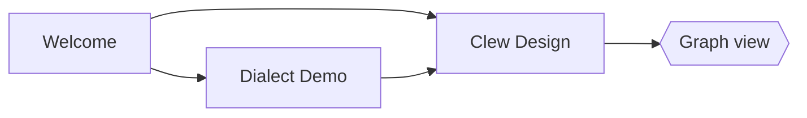

# Diagrams

Mermaid renders client-side in the preview. Obsidian's fence syntax works:

…as does jmarkdown's native form (which also rasterises for LaTeX/PDF
export, via mermaid-cli):

@begin(mermaid)
sequenceDiagram
	Editor->>Engine: note changed
	Engine->>Preview: rendered HTML
	Preview->>Preview: morphdom patch
@end(mermaid)

## TikZ

TikZ compiles at render time (LaTeX + dvisvgm) and caches an SVG next to
the note — so a figure of any complexity costs its compile **once**, and
every render after that is instant. This one is a real figure from a real
paper — "The incompleteness of classical mechanics" (*BJPS*) — and it is
genuinely three-dimensional: the whole scene is drawn in rotated x-y-z
coordinates, and each ring of point particles (a "gravitationally
equivalent decomposition" of the mass on the axis) is generated by a
`\foreach` loop spinning a particle pair around the *x*-axis, force
arrows and all. Switch to source mode to read it.

@begin(TiKZ)
\begin{tikzpicture}[>=latex, rotate around x=10,
  rotate around y=0, rotate around z=0]
  % Draw the axes
  \draw[<->] (-3,0,0) -- (2.5,0,0) node[anchor=west] {$x$};
  \draw[<->] (0,-2.5,0) -- (0,2.5,0) node[anchor=south] {$y$};
  \draw[<->] (0,0,-3) -- (0,0,3) node[anchor=north] {$z$};

  % First mass m_1
  \fill[black] (1,0,0) circle[radius=1pt];
  \draw[->] (1.7, 0.9, 0) node[anchor=west, scale=0.5] {Mass $m_1$}
      to[out=180, in=90] (1, 0.05, 0);

  \foreach \rot in {0,18,...,162} {
    \draw[rotate around x=\rot, very thin,
        arrows={-Latex[scale=0.6]}, lightgray]
        (0,0,0) -- ($ 0.985*(1,0,1) $);
    \fill[rotate around x=\rot] (1,0,1) circle[radius=1pt];

    \fill[rotate around x=\rot] (1,0,-1) circle[radius=1pt];
    \draw[very thin, rotate around x=\rot,
        arrows={-Latex[scale=0.6]}, lightgray]
        (0,0,0) -- ($ 0.985*(1,0,-1) $);
  }

  \draw[gray] (1,0,0) circle[radius=1, rotate around y=90];
  \draw[gray] (-2,0,0) circle[radius=1, rotate around y=90];
  \draw[gray] (-1.9,0,0) circle[radius=1.1, rotate around y=90];

  % Gravitational equivalents for m_2
  \foreach \rot in {0,18,...,162} {
    \draw[rotate around x=\rot, very thin,
        arrows={-Latex[scale=0.6]}, lightgray]
        (0,0,0) -- ($ 0.985*(-2,0,1) $);
    \fill[rotate around x=\rot] (-2,0,1) circle[radius=1pt];

    \fill[rotate around x=\rot] (-2,0,-1) circle[radius=1pt];
    \draw[very thin, rotate around x=\rot,
        arrows={-Latex[scale=0.6]}, lightgray]
        (0,0,0) -- ($ 0.985*(-2,0,-1) $);
  }

  % Gravitational equivalents for m_2
  \foreach \rot in {0,18,...,162} {
    \draw[rotate around x=\rot, very thin,
        arrows={-Latex[scale=0.6]}, lightgray]
        (0,0,0) -- ($ 0.975*(-1.9,0,1.1) $);
    \fill[rotate around x=\rot] (-1.9,0,1.1) circle[radius=1pt];

    \fill[rotate around x=\rot] (-1.9,0,-1.1) circle[radius=1pt];
    \draw[very thin, rotate around x=\rot,
        arrows={-Latex[scale=0.6]}, lightgray]
        (0,0,0) -- ($ 0.975*(-1.9,0,-1.1) $);
  }

  % Unit mass at the origin
  \fill (0,0,0) circle[radius=1pt];
  \draw[->] (-0.75, 1.75,0) node[scale=0.5,anchor=east] {Unit mass at the origin}
      to[out=0, in=110] (-.05,.05,0);

  \fill (-2,0,0) circle[radius=2pt];
  \draw[->] (-1.5,0,2.75) node[scale=0.5, anchor=west] {Mass $m_2$}
  to[out=135, in=270] (-2.5,0,1.2)
  to[out=90, in=195] (-2.1,0,0.05);
\end{tikzpicture}
@end(TiKZ)

## MetaPost

MetaPost's strength is that a figure is a *program*: positions are solved,
not placed. This finite-state machine — the DFA that reads a binary number
and accepts multiples of five — computes its own layout: the states sit on
a circle, every transition curve is cut against the state borders with
`cutbefore`/`cutafter`, and each label is set at the arc-length midpoint
of its (already-trimmed) path, offset along the normal. Move a state and
everything follows.

@begin(metapost)
beginfig(1);
  u := 1cm;

  % The DFA that reads a binary number most-significant-bit first and
  % tracks its value mod 5: from state s, bit b leads to (2s+b) mod 5.
  % Accepting state: 0. Everything below is COMPUTED: the states sit on
  % a circle, and every transition is trimmed against the state borders.
  numeric n; n := 5;
  pair q[]; path state[];
  for i = 0 upto n - 1:
    q[i] := 3.4u * dir(90 + 360 * i / n);
    state[i] := fullcircle scaled 1.3u shifted q[i];
  endfor;

  color zerocol, onecol, statefill;
  zerocol   := (0.15, 0.35, 0.65);
  onecol    := (0.70, 0.20, 0.20);
  statefill := (0.93, 0.93, 0.97);

  % A curved transition from state a to state b: leave a at `bend` degrees
  % off the direct bearing, cut both ends at the circles, arrow it, and
  % set the label a little off the path's midpoint.
  vardef edge(expr a, b, bend, s, c) =
    save p; path p;
    save t; numeric t;
    p := q[a]{dir(angle(q[b] - q[a]) + bend)} .. q[b];
    p := p cutbefore state[a] cutafter state[b];
    drawarrow p withpen pencircle scaled 1 withcolor c;
    t := arctime (arclength p / 2) of p;
    label(s infont defaultfont scaled 0.9,
      point t of p shifted (9 * dir(angle(direction t of p) + 90)))
      withcolor c;
  enddef;

  % A self-loop: out one side of the state, around, back in the other.
  vardef selfloop(expr a, facing, s, c) =
    save p; path p;
    save t; numeric t;
    p := q[a] {dir(facing + 40)} .. q[a] + 1.35u * dir(facing) .. {dir(facing - 220)} q[a];
    p := p cutbefore state[a] cutafter state[a];
    drawarrow p withpen pencircle scaled 1 withcolor c;
    t := arctime (arclength p / 2) of p;
    label(s infont defaultfont scaled 0.9,
      point t of p shifted (9 * dir(facing))) withcolor c;
  enddef;

  % Transitions first, so the state disks sit on top of the trimmed ends.
  selfloop(0, 150, "0", zerocol);     % 0 --0--> 0
  edge(0, 1,  20, "1", onecol);       % 0 --1--> 1
  edge(1, 2,  20, "0", zerocol);      % 1 --0--> 2
  edge(1, 3, -35, "1", onecol);       % 1 --1--> 3
  edge(2, 4, -35, "0", zerocol);      % 2 --0--> 4
  edge(2, 0,  20, "1", onecol);       % 2 --1--> 0
  edge(3, 1,  35, "0", zerocol);      % 3 --0--> 1
  edge(3, 2,  20, "1", onecol);       % 3 --1--> 2
  edge(4, 3,  20, "0", zerocol);      % 4 --0--> 3
  selfloop(4, -18, "1", onecol);      % 4 --1--> 4

  % The states: filled disks, named; the accepting state is double-ringed.
  for i = 0 upto n - 1:
    fill state[i] withcolor statefill;
    draw state[i] withpen pencircle scaled 1;
    label(decimal i infont defaultfont scaled 1.1, q[i]);
  endfor;
  draw fullcircle scaled 1.1u shifted q[0] withpen pencircle scaled 0.8;

  % The start arrow, slanting in clear of the self-loop.
  drawarrow (q[0] + 1.8u * dir(55)) -- (q[0] + 0.7u * dir(55)) withpen pencircle scaled 1;
  label("start" infont defaultfont scaled 0.9, q[0] + 2.05u * dir(55));
endfig;
end.
@end(metapost)

Both need a TeX toolchain installed; the SVGs cache in `TiKZ/` and
`MetaPost/` folders beside this note, so a vault renders its figures
even on a machine with no TeX at all.
